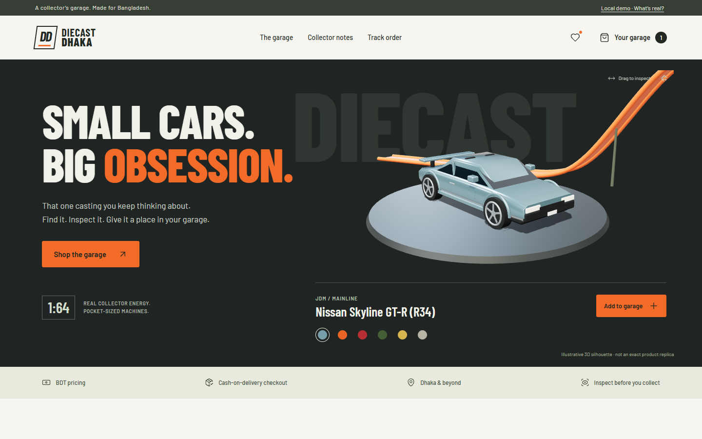
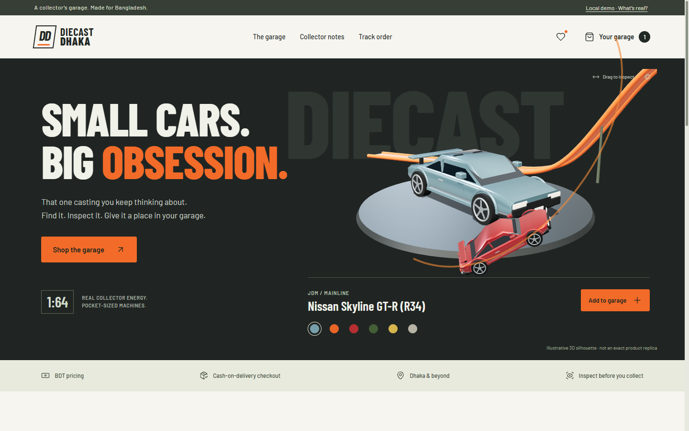
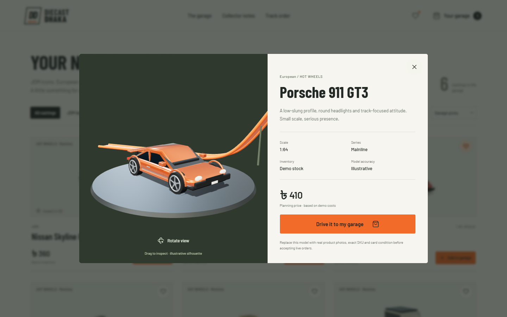
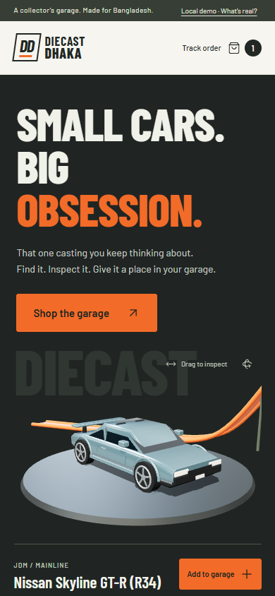
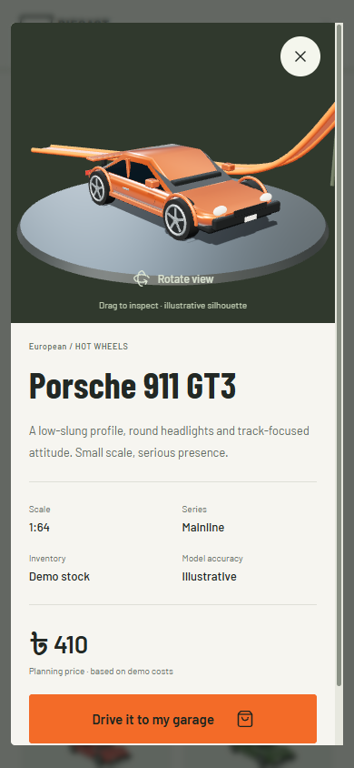

# Diecast Dhaka

**A 3D die-cast resale storefront prototype for Bangladesh.**

A collector's garage rather than a generic toy-store banner: graphite studio lighting, racing-orange track, dimensional cars and a pale inventory bench. This repository preserves **only the current showcase version**, tagged [`v1.0.0-prototype`](https://github.com/MdSadman2004/Diecast-Dhaka/releases/tag/v1.0.0-prototype). No website features were changed for publication.

> **Portfolio prototype—not a live shop.** Catalog, stock, costs and delivery charges are demonstrations. Checkout stores local demo orders; it does not collect money, purchase supplier stock or initiate delivery. Procedural cars are illustrative silhouettes, not exact Mattel replicas or authenticated product photographs.



## The signature interaction

Choose a casting, inspect it in 3D and add it to your garage. **That car's model and color** drive along an orange trajectory into the cart button, with moving wheels and a complete animated sequence. The cart updates afterward. Reduced-motion users get a direct add without the driving effect.



## Features in this snapshot

- Six separately dimensioned 3D casting-inspired vehicles, metallic paint, tinted glazing, interiors, wheels, spoilers and studio shadows.
- Drag/rotate inspection, generated 3D thumbnails and casting selection.
- Search, collection filters, price sorting and saved cars.
- Persistent local cart, quantity controls and BDT totals.
- Bangladesh phone validation and Dhaka/outside-Dhaka demo delivery selection.
- Demo cash-on-delivery checkout backed by persistent SQLite, server-authoritative prices and atomic stock reservation.
- Order tracking protected by both an opaque order reference and matching phone number.
- Owner workbench for stock, cost allocations, margin forecasts, order status and one-time cancellation restocking. Disabled until a local admin key is configured.
- Responsive desktop/mobile layouts, native dialogs and reduced-motion support.

<details>
<summary>Product inspection and mobile screenshots</summary>



| Mobile garage | Mobile inspection |
|---|---|
|  |  |

</details>

## The 30% margin target

The owner calculator uses:

```text
selling price =
  (landed cost + packaging + overhead + return reserve + shipping subsidy)
  / (1 - target margin - payment fee rate)
```

It rounds **up to the next BDT 10**. The default margin target is **30%**; this is not the same as adding a 30% markup to cost. Landed cost should include purchase cost, inbound shipping, conversion and applicable duties. Delivery is modeled separately as a pass-through charge and excluded from the merchandise-margin forecast.

**This is an entered-cost forecast, not guaranteed realized business net profit.** The sample prices are not market quotations. Real sourcing, taxes, operating expenses, losses, discounts, courier fees and demand still need validation.

## Run locally

Requires **Node.js 22.13+** and npm. The production build and automated suite were executed with Node.js 26.7.0.

```bash
git clone https://github.com/MdSadman2004/Diecast-Dhaka.git
cd Diecast-Dhaka
git checkout v1.0.0-prototype
npm ci
npm run build
npm start
```

Open **http://127.0.0.1:5188**. The service binds to loopback by default and creates its own demonstration database on first start. Stop a foreground server with Ctrl+C.

Alternatively, download the [prototype release](https://github.com/MdSadman2004/Diecast-Dhaka/releases/tag/v1.0.0-prototype), extract the prebuilt ZIP and run `npm start`. Node is still required; this is not a standalone executable. On Windows, `START-WEBSITE.cmd` / `STOP-WEBSITE.cmd` are supplied for Python-enabled machines. The release includes build output but no dependencies, credentials or database.

### Development

Run `npm start` for the backend. In another terminal:

```bash
npm run dev
```

Vite serves the frontend on **127.0.0.1:5189** and proxies `/api` to port **5188**.

### Optional owner workbench

Copy `.env.example` to `.env`, manually set a long unique `ADMIN_KEY`, restart the server, then open **http://127.0.0.1:5188/admin**. Never commit or share the key. The shared local key is a prototype mechanism, not production account management.

## Stack and architecture

| Layer | Implementation |
|---|---|
| UI | Vanilla JavaScript, semantic HTML, responsive CSS |
| 3D | Three.js, authored procedural geometry, room-environment lighting |
| Build | Vite; self-hosted Barlow / Barlow Condensed; selected Lucide icons |
| Server | Node HTTP and built-in `node:sqlite` |
| Persistence | Local SQLite for catalog, allocations, inventory and orders |

```text
src/         storefront, owner UI and 3D model/animation code
server/      HTTP routes, persistence, catalog seed and pricing
public/      authored brand favicon
tests/       backend, vehicle and local browser verification
docs/images/ actual screenshots of this version
```

See [BACKEND.md](BACKEND.md) for API/operations, [DESIGN.md](DESIGN.md) for the extracted design system, and [ASSET-PROVENANCE.md](ASSET-PROVENANCE.md) for asset origins.

## Verification

```bash
npm test
npm run build
```

The tested snapshot passed **30 Node tests** covering real HTTP/SQLite, price tampering, stock transactions, persistence, authorization, phone-protected lookup, origin checks, body limits, rate limits, traversal protection and six vehicle variants. Geometry regressions include outward roof normals.

The original local website was also exercised in authorized Chrome: **21 end-to-end check groups** and **7 focused desktop/mobile inspection checks** passed. These browser scripts require the author's explicitly authorized local Chrome/CDP fixture and are **not portable CI or public-demo tests**. They must not be run against real customer data. Browser claims are not a full accessibility, security, performance or cross-device certification.

Known prototype debt includes small supporting type/targets, the orange focus outline's contrast on paper and a track/instruction overlap. The verified product inspector uses a fixed, scrollable modal with sticky dismissal controls.

## Scope and rights

- This is one versioned portfolio snapshot, not a public live-store deployment. GitHub Pages would not run the order backend.
- Real SKUs, stock-matched photos, card condition, business details, sourcing/courier costs, privacy/returns terms, live-catalog management and production authentication/hosting/payment/fulfillment services remain prerequisites for real sales.
- Private `.env` files, databases, customer/order records, logs and internal browser reports are excluded.
- `SNAPSHOT.json` records SHA-256 hashes of the unchanged application and supporting source files.
- Hot Wheels, Mattel and vehicle names are trademarks of their respective owners. This independent showcase claims no official partnership.
- No open-source license has been assigned to the original application code. Third-party libraries/fonts retain their respective licenses; notices are included in `THIRD-PARTY-NOTICES/`.
